# GitHub 초대받기

##### 이제 호찬이에게 아이디를 알려주면 확인 후 밑에와 같이 GitHub 가입 할 때 입력했던 이메일로 메일이 옵니다. 이후 클릭하고 들어가면 가입 완료 됩니다.
 

# pull_requests  

##### GitHub 에는 Pull requests 라는 협업 기능이 있습니다.   
##### [Pull requests란?](http://minsone.github.io/git/github-Pull-Request)  

##### 위 URL에서 봤듯이 Pull requests 과정이란 자신의 repository에 상대방의 repository에 저장된 data를 복제해와서 수정하고 서로 코드를 보고 의견을 말한  뒤 반영 할지 안할지 정하는 과정입니다. 우리는 여러 기능들은 아직 필요없고 간략히 쓸 기능만 소개하겠습니다. 우선 ProHC 아이디로 설명해 보겠습니다.  

  

##### GitHub 프로젝트에 초대가 완료되면 로그인 뒤 나오는 가장 초기 페이지에 위 그림과같이 두개 repository가 새로 생깁니다.
##### 위 hochan222/Prohect_2_search_ope... 은 아래 사진과같이 호찬이 계정의 GitHub에 저장된 앞으로 팀원들이 최종적으로 저장 할 공간이고, 밑에 Project_2_search_open_projects는 호찬이의 저장소에 저장되어있는 데이터를 그대로 복사해서 내 저장소 안에 저장시킨겁니다.  

##### 먼저, hochan222/Prohect_2_search_ope...로 들어가 보면

  

##### 위에 hochan222/Prohect_2_search_open_projects에서 hochan222가 호찬이의 계정에 저장되있는 저장소를 의미합니다.

##### - 파랑색 사각형 부분은 저장된 파일들을 나타냅니다.
##### - 초록색 사각형 부분에서 앞에 파일모양이 폴더를 의미합니다.
##### - 갈색 사각형 부분에서 앞에 파일 모양이 파일을 의미하며 파일명 뒤에 .md 가 문서파일을 의미하고 .md가 안붙어있으면 코드파일을 의미합니다.

  

##### 다시 원래 페이지로 돌아와서 이번에는 Project_2_search_open_projects로 들어가 봅시다.

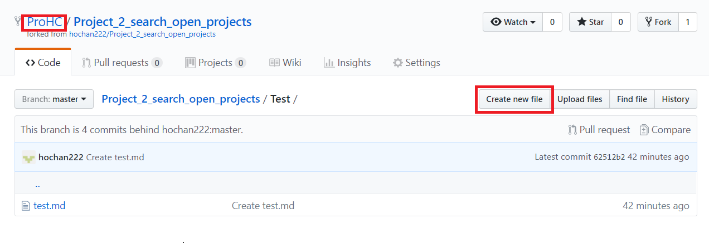  

##### 위의 그림과 같이 hochan222/Project_2_search_open_projects 에서 ProHC/Project_2_search_open_projects로 바뀐 것을 볼 수 있습니다. 자신의 저장소에 그대로 복사해온 것입니다.
##### 자신의 저장소로 옮겨와서 작업을 한 뒤에 다시 원래 저장소에 반영 시키는 것이 Pull requests 과정입니다.  
##### Create new file을 눌러서 파일을 만들어 보겠습니다.

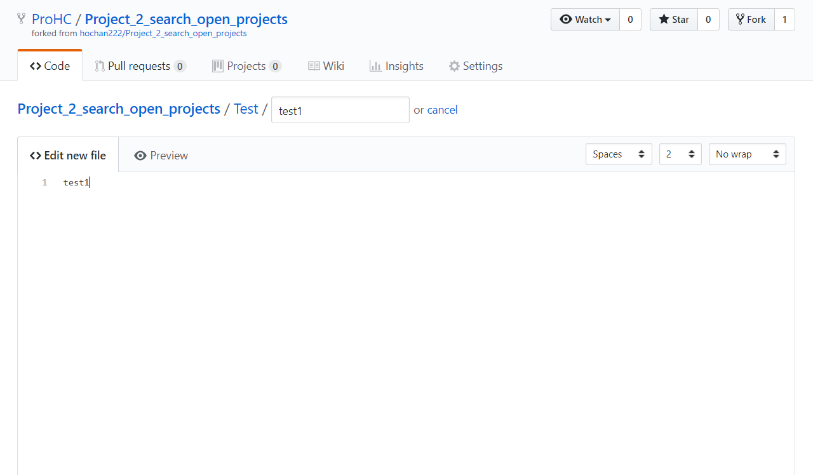  
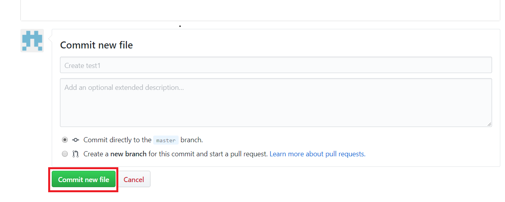 
##### Commit new file 클릭
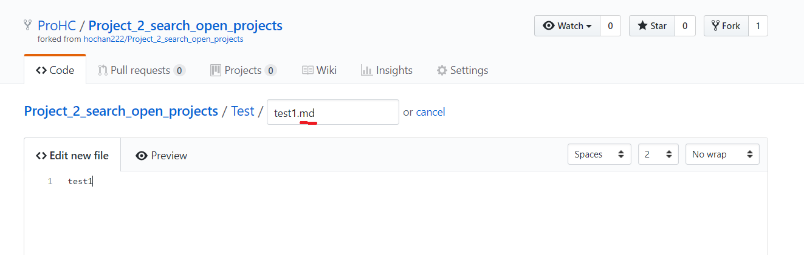  
##### text파일은 파일명 뒤에 .md를 붙입니다.  

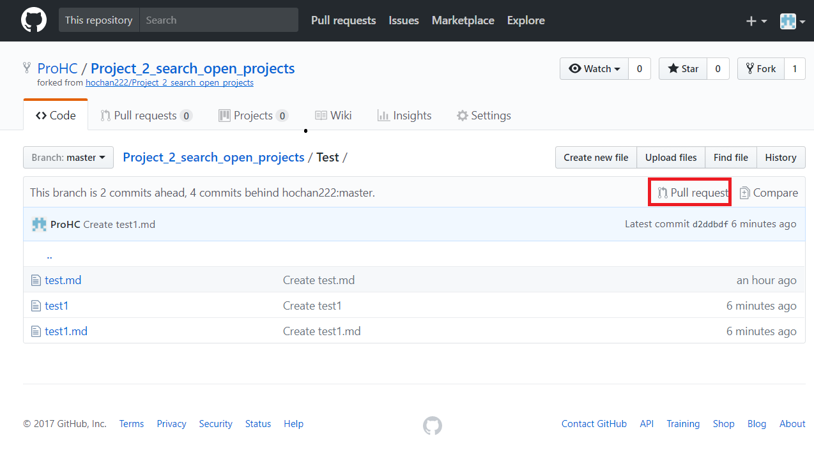
##### 이제 자신의 저장소에 수정된 소스를 최종 저장소인 공통의 저장소에 반영시키는 작업을 해봅시다.  
##### Pull request 클릭  
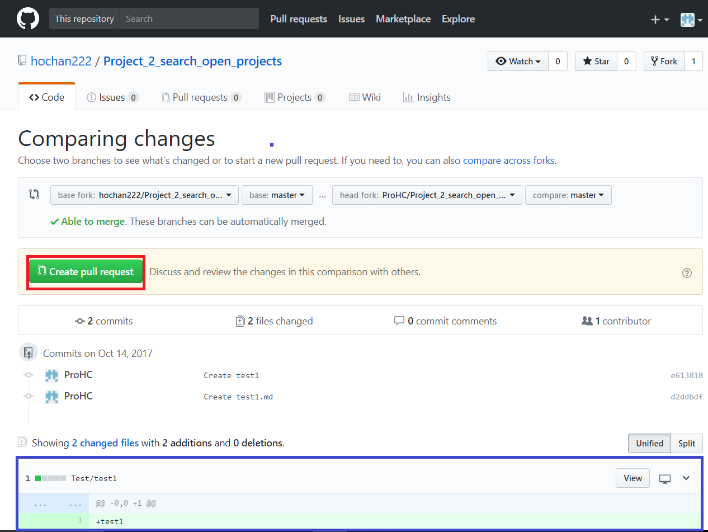 
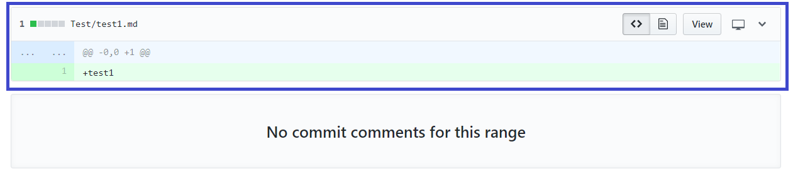  
##### Create pull request 클릭    
##### 파란색 사각형안의 소스코드는 공통의 프로젝트에 있는 원래 소스와 반영시킬 자신의 소스를 비교해서 변경사항을 알려줍니다.  
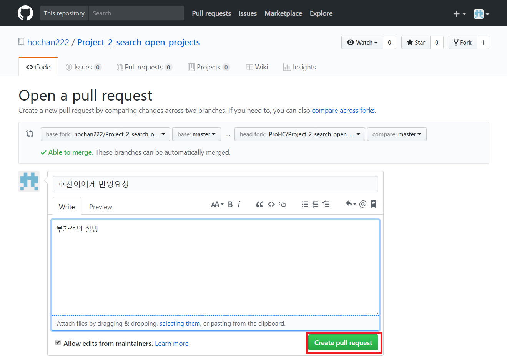  
##### Create pull request 클릭  
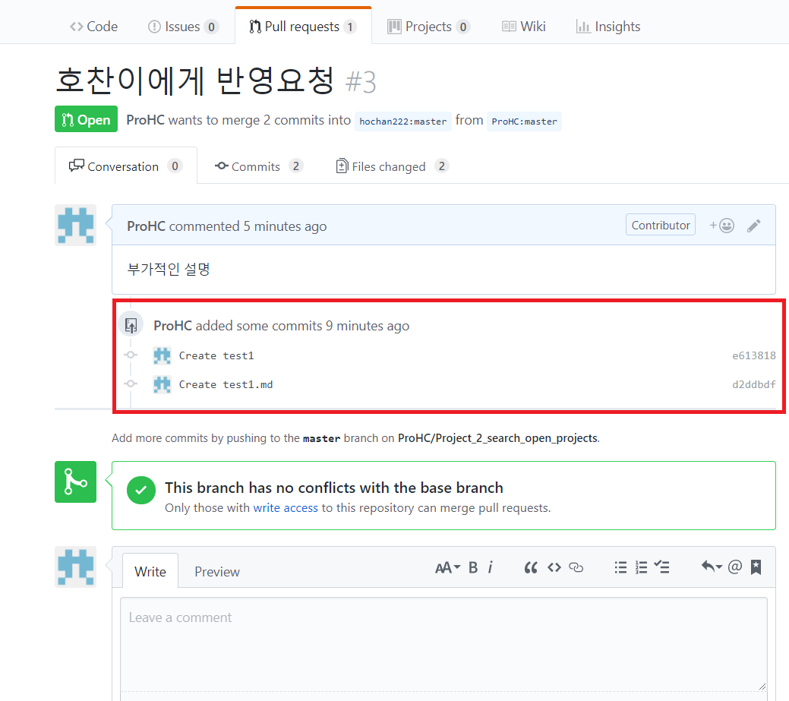
##### 반영 요청을 보낸것을 확인 할 수 있으며 이 공간에서 의견도 나눌 수 있습니다.  
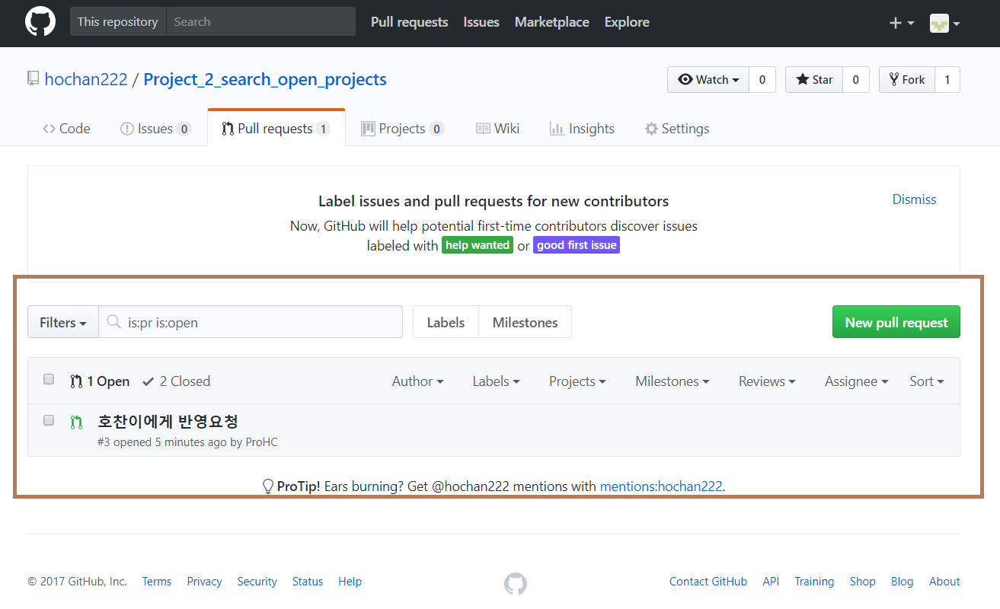
##### 이렇게 반영 요청을 보내면 호찬이의 계정에 위 사진과같이 반영 요청이 들어오고 호찬이가 다음과 같은 과정으로 승인해서 공통의 저장소로 최종 반영시킵니다.  
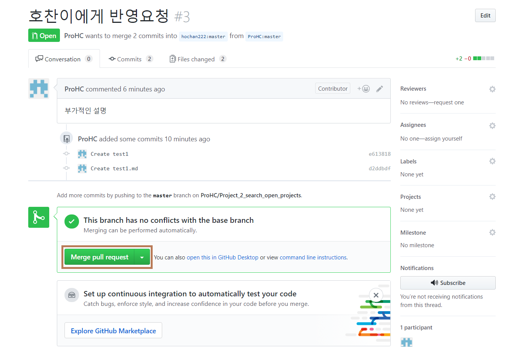  
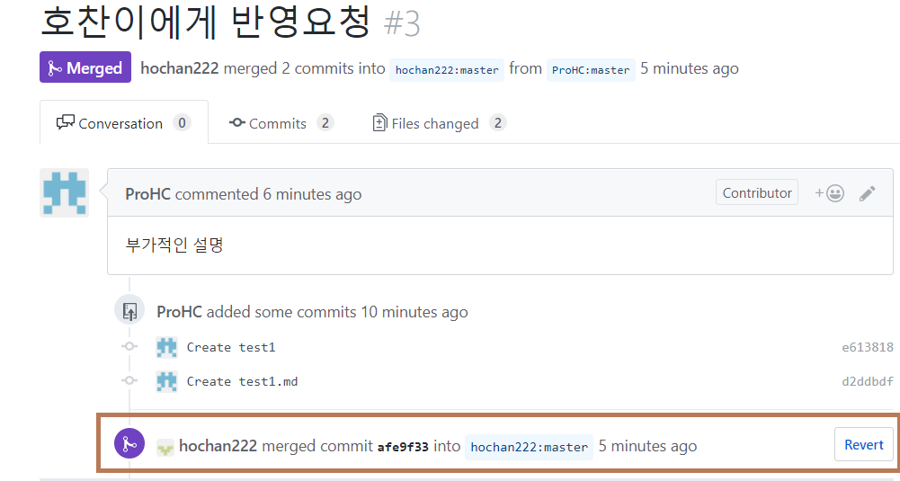  
##### 호찬이가 최종 반영 시켰다는 알림을 볼 수 있습니다.
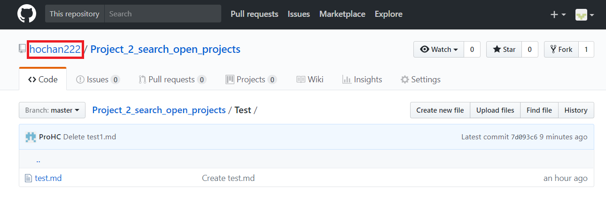  
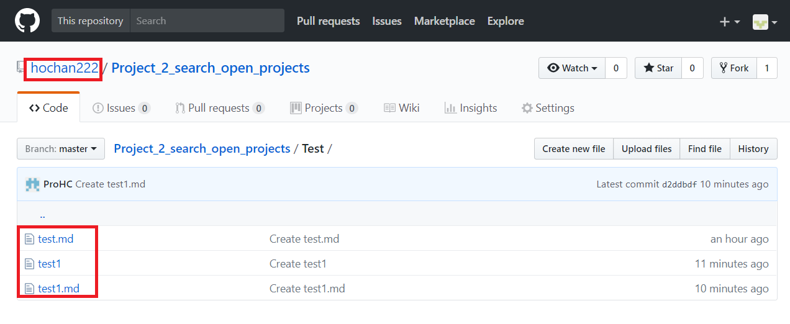  
##### 자신의 저장소에서 수정한 소스가 공통의 저장소로 최종 반영이 된것을 확인 할 수 있습니다.
