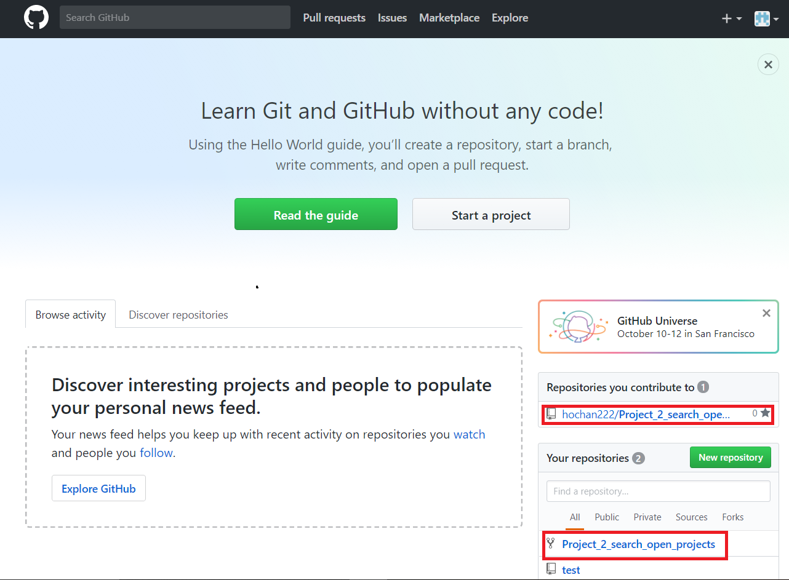
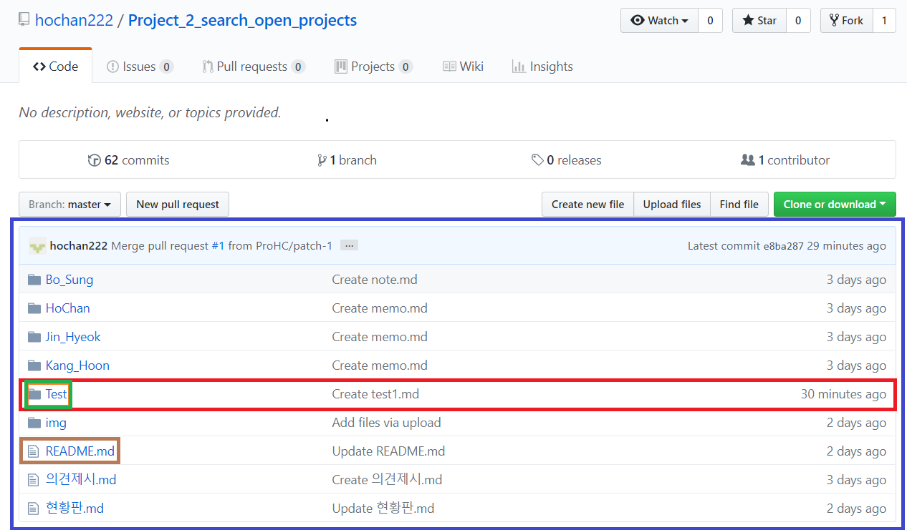

# GitHub 초대받기

##### 이제 호찬이에게 아이디를 알려주면 확인 후 밑에와 같이 GitHub 가입 할 때 입력했던 이메일로 메일이 옵니다. 이후 클릭하고 들어가면 가입 완료 됩니다.
 

# pull_requests  

##### GitHub 에는 Pull requests 라는 협업 기능이 있습니다.   
##### (Pull requests란?)[http://minsone.github.io/git/github-Pull-Request]  

##### 위 URL에서 봤듯이 Pull requests 과정이란 자신의 repository에 상대방의 repository에 저장된 data를 복제해와서 수정하고 서로 코드를 보고 의견을 말한  뒤 반영 할지 안할지 정하는 과정입니다. 우리는 여러 기능들은 아직 필요없고 간략히 쓸 기능만 소개하겠습니다.   

  

##### GitHub 프로젝트에 초대가 완료되면 로그인 뒤 나오는 가장 초기 페이지에 위 그림과같이 두개 repository가 새로 생깁니다.
##### 위 hochan222/Prohect_2_search_ope... 은 아래 사진과같이 호찬이 계정의 GitHub에 저장된 앞으로 팀원들이 최종적으로 저장 할 공간이고, 밑에 Project_2_search_open_projects는 호찬이의 저장소에 저장되어있는 데이터를 그대로 복사해서 내 저장소 안에 저장시킨겁니다.  

  
