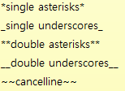

# URL  
https://namu.wiki/w/%EB%A7%88%ED%81%AC%EB%8B%A4%EC%9A%B4 -WIKI  
https://stackedit.io/editor -exp  
http://danielku.com/posts/2014-02-13-markdown/ -exp  
https://gist.github.com/ihoneymon/652be052a0727ad59601 -exp  
https://simhyejin.github.io/2016/06/30/Markdown-syntax/ -exp(codeblock)  
http://pad.haroopress.com/user.html -Tool  

MarkDown 문법 예제
=============

    MarkDown 문법 예제  
    ============= 

##### 글 작성뒤 맨뒤에 두칸의 공백을 띄우면 다음 줄로 표현된다

# 예제1
-------------

# This is a H1
## This is a H2
### This is a H3
#### This is a H4
##### This is a H5
###### This is a H6  

    # 예제1
    -------------

    # This is a H1  
    ## This is a H2  
    ### This is a H3  
    #### This is a H4  
    ##### This is a H5  
    ###### This is a H6  

예제2
-------------
> This is a first blockqute.
>> This is a second blockqute.
>>> This is a third blockqute.

    예제2
    -------------
    > This is a first blockqute.
    >> This is a second blockqute.
    >>> This is a third blockqute.

예제3
-------------
* 빨강
  * 녹색
    * 파랑

+ 빨강
  + 녹색
    + 파랑

- 빨강
- 녹색
- 파랑

예제4
-------------
This is a normal paragraph:

    This is a code block.
end code block.

    앞에 공백 4개 띄우고 작성하면 된다   

예제5
-------------
* * *

***

*****

- - -

---------------------------------------

예제6
-------------

[호찬이의 MarkDown 설명서](https://github.com/hochan222/Search/edit/master/MarkDown.md)  

     [호찬이의 MarkDown 설명서](https://github.com/hochan222/Search/edit/master/MarkDown.md)  
     

<http://example.com/>
<address@example.com>  

     <http://example.com/>
     <address@example.com>

예제7
-------------
*single asterisks* 
_single underscores_
**double asterisks**
__double underscores__
~~cancelline~~  

 

예제 8 - 이미지 삽입   
--------------  
     
     붙이면 됨
     

##### 가장 기초적인 예제만 다루었으며 나머지 MarkDown 문법은 Google에 검색해보세요  
