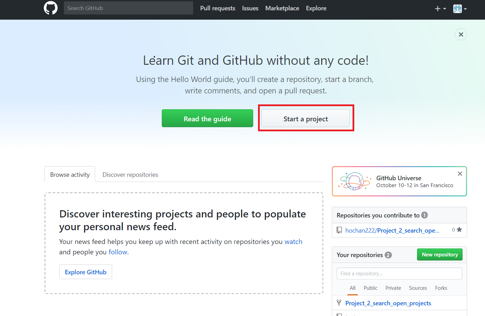
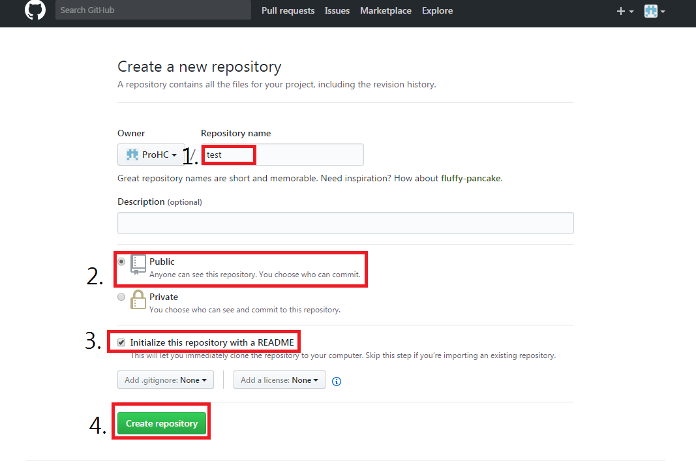
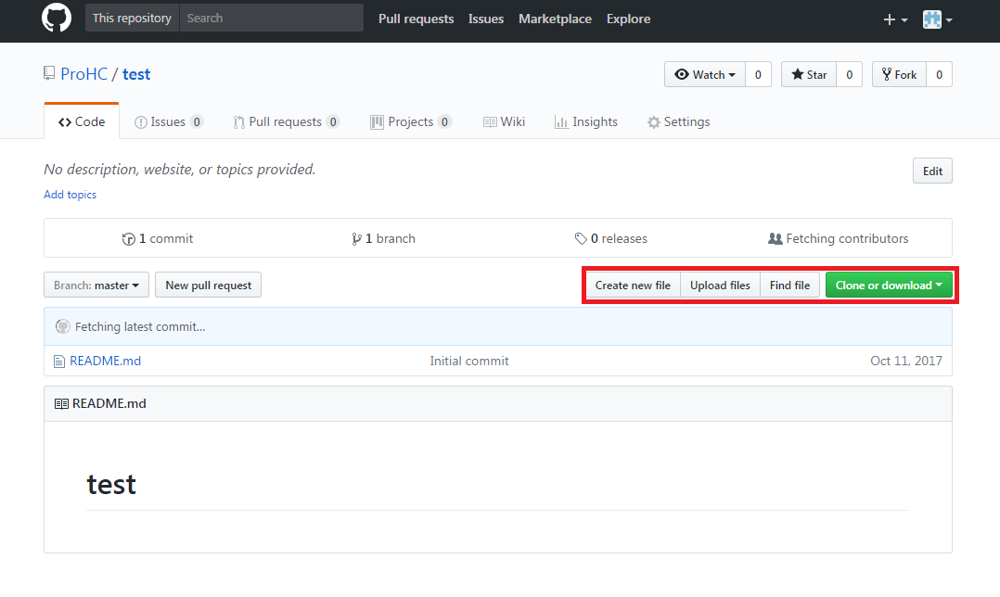
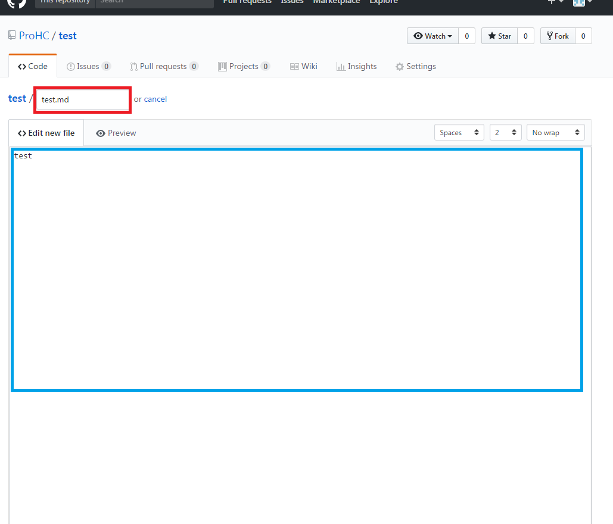

# repository 저장소 만들기

##### 우선 사용할 간단한 기능만 설명하겟습니다.  

##### Start a project 클릭  
  

##### 1.Repository name : 자신이 만들 저장소의 이름을 적는 공간입니다.   
##### 2.Public 체크 : GitHub 에서는 모든 소스를 공개로 하면 무료로 이용 할 수 있고 Private은 별도로 이용 요금을 내야 한다.  
##### 3.Initialize this repository with a README.md : 체크 하게되면 저장소를 생성할때 저장소 설명을 쓸 수 있는 ReadMe 파일이 생긴다. 체크를 하지 않아도 나중에 만들 수 있다.  
##### 4. Create repository : 누르면 위 정보를 토대로 repository가 생성된다.   

  

##### 생성된 repository의 main page이다.
##### Create new file : 문서 작성, 폴더 생성, 코드 생성을 할 수 있다.  
##### Upload files : 자신의 데이터를 GitHub 에 올릴 때 사용한다.  

### Create new file  
-------------------  
  

##### 빨간 네모 부분에 파일 명을 적으며, 파일 명으로 만드는 파일을 속성을 정의 할 수 있다.  
##### '파일 이름.md' 과 같이 파일명 뒤에 .md를 붙이면 text 파일을 생성 할 수 있습니다.  
##### '파일 이름' 으로 파일명을 설정하면 코드 파일이 만들어진다.
##### '파일이름/' 과 같이 파일명 뒤에 /를 붙이고 ENTER를 누르면 폴더를 생성 할 수 있으며 빈 폴더는 생산 불가능하며 폴더 안에는 1개 이상의 파일들이 반드시 존재 하여야 한다.

## 참고 
http://hashcode.co.kr/questions/2277/github-git-bash%EB%A1%9C-%ED%8F%B4%EB%8D%94-%EC%98%AC%EB%A6%AC%EA%B8%B0 - 폴더 생성법
